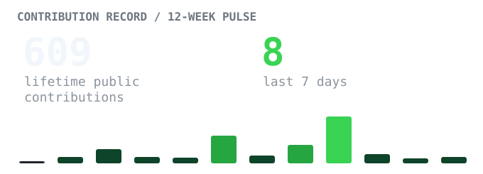
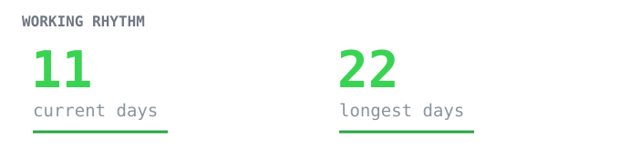
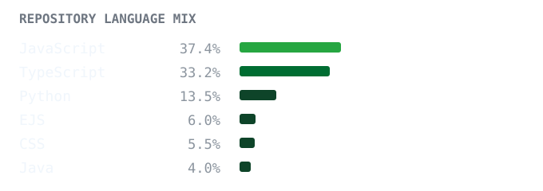
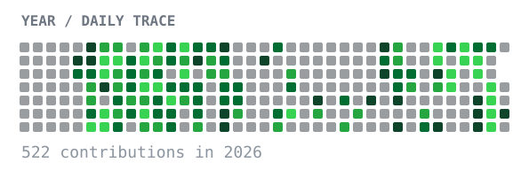

 

  

  

I take software from a rough idea to something people can actually use: designed, built, secured, and deployed.

### Currently building

Full-stack products · early SaaS ideas · software for real clients

### GitHub activity

  
  
  
  

These graphics are generated in this repository from GitHub's API; no external stats service, tracker, or contribution snake.

### Tech stack

`Languages` &nbsp; JavaScript · TypeScript · Python · C/C++ 
`Frontend` &nbsp;&nbsp; React · Vite · Tailwind CSS 
`Backend` &nbsp;&nbsp;&nbsp; Node.js · Express · REST APIs 
`Data` &nbsp;&nbsp;&nbsp;&nbsp;&nbsp;&nbsp; MongoDB · PostgreSQL fundamentals 
`Tools` &nbsp;&nbsp;&nbsp;&nbsp;&nbsp; Git · GitHub · Linux · Docker fundamentals 
`Security` &nbsp;&nbsp; Network security · TCP/IP & OSI · Wireshark · Suricata · PKI · VAPT fundamentals

### Selected work

**Velora** → A secure MERN commerce platform with JWT authentication, role-based access, Razorpay payments, Cloudinary media, Shiprocket fulfilment, and product search. 
`React · Node.js · Express · MongoDB`

**[SkillSprint Technologies](https://www.skillsprinttechnologies.com/)** → A production website built for a real client, shaped around their services and day-to-day business needs. 
`Web development · Client delivery`

**AutoMate** → An automation project focused on removing repetitive work through small, practical software workflows. 
`Automation · Software tooling`

**[Wanderlust](https://github.com/irohankumars/Wanderlust)** → A travel discovery platform with modular REST APIs, authentication, and scalable listings. [Live site](https://wanderlust-72vc.onrender.com/listings). 
`React · Node.js · Express · MongoDB · JWT`

### Currently exploring

Cybersecurity · systems · network fundamentals · useful automation

Through **Glora Studio**, some of that work becomes software for clients, not just experiments that stop at GitHub.

### Connect

[Portfolio](https://rohankumars.dev/) · [LinkedIn](https://www.linkedin.com/in/rohankumars) · [GitHub](https://github.com/irohankumars) · [Email](mailto:kumarsrohan2@gmail.com)

<code>build · break · learn · repeat</code>
